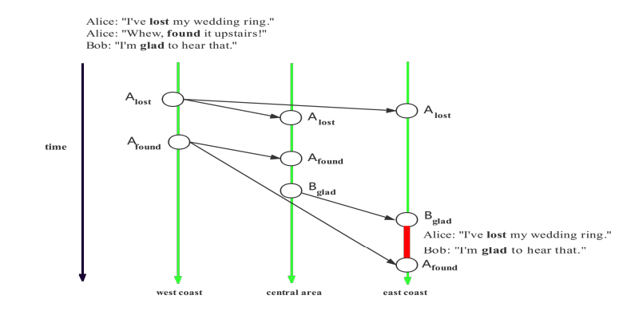

# Lab2

## Compile & Run

Install Go 1.16 or higher at https://go.dev/doc/install

`$ cd Lab2`

`$ go build -o lab2`

Run the program by `$ ./lab2`

## System Description

### General

The system is a distributed key-value data storage following causal consistency. The focus is on causal consistency. Causal consistency is important. See the following example:



For this lost wedding ring example,

- A posts “**lost**” and then “**found**” in the west coast server.
- Then B reads them from the central area server, and posts “**glad**”. 
- In the east coast server, due to the communication delay, A’s “**found**” arrives later than B’s “**glad**”, making B look weird for commenting “**glad**” on A’s “**lost**”.

The problem is because the east-coast server does not follow causal consistency, which states that A’s “**found**” should happen before B’s “**glad”**.

### Supported Features

#### Client

- connect to one of the servers in the system
- provide a key and get its value from the system
- write a key value pair in the system
- feature to better illustrate causal consistency
  - when writing a key value pair, provide in addition a server’s `ip:port` and delay in seconds to simulate network delay of between-server replicated writes

#### Server

- bind to an `ip:port` to accept client connections
- cooperate with other servers in the system to ensure causal consistency

### Communication Protocol

Client-server communications and server-server communications are implemented with `json` data over TCP connections. 

Every `json` message consists of **Op** and **Args** to indicate the operation and the arguments.

## Program Description

The program is a command line application with detailed help prompts. It can be run in either client mode or server mode:

- `$ ./lab2 client`
- `$ ./lab2 server`

Then, the application enters an interactive environment supporting following commands:

- client mode

  - connect [ip:port of server]

  - read [key]

  - write [key] [value] [delay replicated write ip:port of server (optional)] [delay in seconds (optional)]

  - help, h

  - quit, q


- Server mode

  - start [ip:port to listen to] [ip:port of other servers (if multiple, separate by space)]

  - quit, q

  - help, h

## Program Structure

The program is written in Go. It consists of 5 packages.

- `package main` includes the main function that starts the program
- `package client` includes the logic when the program runs in client mode
- `package server` includes the logic when the program runs in server mode
- `package communication` includes the communication protocol specifications
- `package util` includes helper functions

## Which part works and which part does not

The program works.

## Sample Output

- First set up 3 servers **S1**, **S2**, **S3** to listen on `localhost:11111`, `localhost:22222`, `localhost:33333`. Then Connect client **C1** to **S1**, client **C2** to **S2**.

- In **C1**, write 2 values, setting some delay for server replicated write going to **S3**, letting **x -> lost** to arrive later than **y -> found** in **S3**

```
write x lost localhost:33333 20
successfully written "x" -> "lost"
write y found localhost:33333 15
successfully written "y" -> "found"
```

- Then in **C2**, read the value of **y** to be **found** and write **z -> glad** with no delay

```
read y
"y" -> "found"
write z glad
successfully written "z" -> "glad"
```

- In **S1** things are uninteresting

```
INFO: handling:
{
        "Op": "write",
        "Args": {
                "ClientId": "45b53a40-1a9d-4832-b1e1-9af5c0f882b9",
                "Key": "x",
                "Value": "lost",
                "ReplicatedWriteDelayServer": "localhost:33333",
                "ReplicatedWriteDelayInSeconds": 20
        }
}
>>>>> committed "x"->"lost"
INFO: handling:
{
        "Op": "write",
        "Args": {
                "ClientId": "45b53a40-1a9d-4832-b1e1-9af5c0f882b9",
                "Key": "y",
                "Value": "found",
                "ReplicatedWriteDelayServer": "localhost:33333",
                "ReplicatedWriteDelayInSeconds": 15
        }
}
>>>>> committed "y"->"found"
INFO: handling:
{
        "Op": "replicated_write",
        "Args": {
                "Key": "z",
                "Value": "glad",
                "ClientId": "59d08b6e-0677-4ca1-ad81-4811e42b2eef",
                "Dependencies": [
                        {
                                "Key": "y",
                                "OriginalServer": "localhost:11111",
                                "LamportsClockTimestamp": 2
                        }
                ],
                "OriginalServer": "localhost:22222",
                "Clock": 4
        }
}
>>>>> committed "z"->"glad"
```

- In **S2** things are uninteresting

```
INFO: handling:
{
        "Op": "replicated_write",
        "Args": {
                "Key": "x",
                "Value": "lost",
                "ClientId": "45b53a40-1a9d-4832-b1e1-9af5c0f882b9",
                "Dependencies": [],
                "OriginalServer": "localhost:11111",
                "Clock": 1
        }
}
>>>>> committed "x"->"lost"
INFO: handling:
{
        "Op": "replicated_write",
        "Args": {
                "Key": "y",
                "Value": "found",
                "ClientId": "45b53a40-1a9d-4832-b1e1-9af5c0f882b9",
                "Dependencies": [
                        {
                                "Key": "x",
                                "OriginalServer": "localhost:11111",
                                "LamportsClockTimestamp": 1
                        }
                ],
                "OriginalServer": "localhost:11111",
                "Clock": 2
        }
}
>>>>> committed "y"->"found"
INFO: handling:
{
        "Op": "read",
        "Args": {
                "ClientId": "59d08b6e-0677-4ca1-ad81-4811e42b2eef",
                "Key": "y"
        }
}
INFO: handling:
{
        "Op": "write",
        "Args": {
                "ClientId": "59d08b6e-0677-4ca1-ad81-4811e42b2eef",
                "Key": "z",
                "Value": "glad",
                "ReplicatedWriteDelayServer": "",
                "ReplicatedWriteDelayInSeconds": 0
        }
}
>>>>> committed "z"->"glad"
```

- In **S3** things are interesting because the replicated writes going to **S3** have some simulated network delay
  - **z -> glad** arrives first but cannot be committed because it depends on **y**
  - **y -> found** arrives later but cannot be committed because it depends on **x**
  - **x -> lost** arrives and can be committed because it has no dependency
  - then **y -> found** can be committed because **x** is committed
  - then **z -> glad** can be committed because **y** is committed
  - causal consistency is maintained

```
INFO: handling:
{
        "Op": "replicated_write",
        "Args": {
                "Key": "z",
                "Value": "glad",
                "ClientId": "59d08b6e-0677-4ca1-ad81-4811e42b2eef",
                "Dependencies": [
                        {
                                "Key": "y",
                                "OriginalServer": "localhost:11111",
                                "LamportsClockTimestamp": 2
                        }
                ],
                "OriginalServer": "localhost:22222",
                "Clock": 4
        }
}
INFO: delaying the write of "z"->"glad"
INFO: delaying the write of "z"->"glad"
INFO: delaying the write of "z"->"glad"
INFO: delaying the write of "z"->"glad"
INFO: delaying the write of "z"->"glad"
INFO: delaying the write of "z"->"glad"
INFO: delaying the write of "z"->"glad"
INFO: handling:
{
        "Op": "replicated_write",
        "Args": {
                "Key": "y",
                "Value": "found",
                "ClientId": "45b53a40-1a9d-4832-b1e1-9af5c0f882b9",
                "Dependencies": [
                        {
                                "Key": "x",
                                "OriginalServer": "localhost:11111",
                                "LamportsClockTimestamp": 1
                        }
                ],
                "OriginalServer": "localhost:11111",
                "Clock": 2
        }
}
INFO: delaying the write of "y"->"found"
INFO: delaying the write of "z"->"glad"
INFO: delaying the write of "y"->"found"
INFO: delaying the write of "z"->"glad"
INFO: delaying the write of "y"->"found"
INFO: delaying the write of "z"->"glad"
INFO: delaying the write of "y"->"found"
INFO: delaying the write of "z"->"glad"
INFO: delaying the write of "y"->"found"
INFO: delaying the write of "z"->"glad"
INFO: handling:
{
        "Op": "replicated_write",
        "Args": {
                "Key": "x",
                "Value": "lost",
                "ClientId": "45b53a40-1a9d-4832-b1e1-9af5c0f882b9",
                "Dependencies": [],
                "OriginalServer": "localhost:11111",
                "Clock": 1
        }
}
>>>>> committed "x"->"lost"
>>>>> committed "y"->"found"
>>>>> committed "z"->"glad"
```
